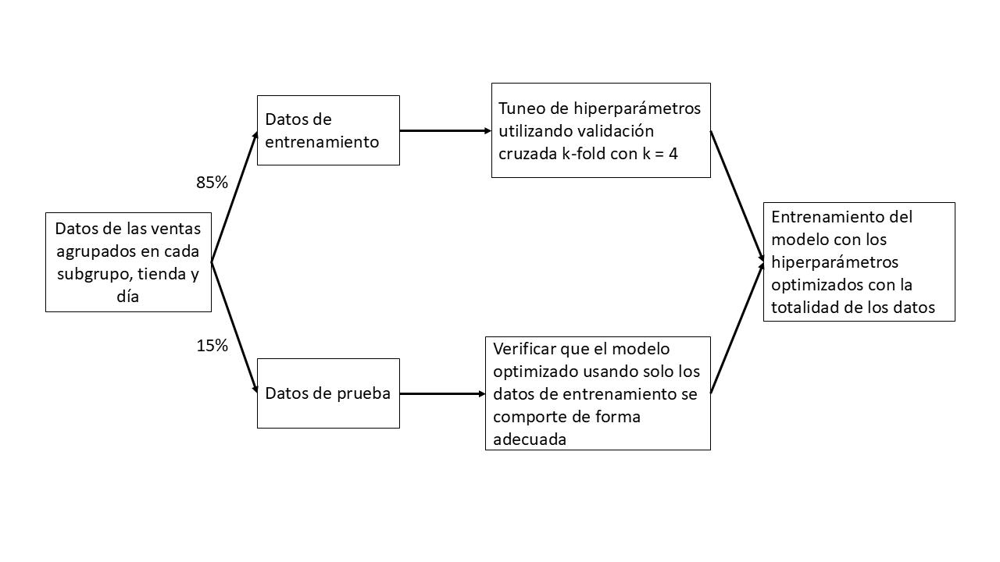

```{r setup, include=FALSE, results='hide'}
knitr::opts_chunk$set(echo = FALSE, 
                      warning = FALSE,
                      message = FALSE, 
                      fig.align = "center")
```

```{r, results='hide'}
library(dplyr)
library(knitr)
library(kableExtra)
library(readr)
library(sparklyr)
library(ggplot2)
library(data.table)
library(arrow)
library(plotly)
library(lubridate)
library(usmap)

eci_stores <- read_csv("Datos/eci_stores.csv")

eci_product_groups <- read_csv("Datos/eci_product_groups.csv")

eci_product_master <- read_csv("Datos/eci_product_master.csv")

eci_stores_clusters <- read_csv("Datos/eci_stores_clusters.csv")

eci_customer_data <- read_csv("Datos/eci_customer_data.csv")

load("../datos_tabla.RData", verbose = TRUE)
```

```{r}
#Datos

#df <- fread("Datos/eci_transactions.csv")  

#write_parquet(df, "eci_transactions.parquet")

#Configuraciones de spark
config <- spark_config()

# Establecemos la coneccion con spark
sc <- spark_connect(master = "local", config = config)

#ds <- open_dataset("eci_transactions.parquet")

#eci_transactions <- spark_read_parquet(sc, name = "eci_transacciones", path = "../eci_transactions.parquet")

#Para la base completa

# Copiar tabla de tiendas y productos a Spark

#eci_product_master <- rename(eci_product_master, SKU = sku, SUBGROUP = subgroup)
#eci_stores_tbl   <- copy_to(sc, eci_stores,        name = "eci_stores",        overwrite = TRUE)
#eci_products_tbl <- copy_to(sc, eci_product_master, name = "eci_product_master", overwrite = TRUE)

#Agrego los costos y precios base

#datos_tbl <- eci_transactions %>%
#  left_join(eci_products_tbl, by = c("SKU", "SUBGROUP"))

#Agrupo por el día, subproducto y tienda.

#print(colnames(datos_tbl))#Voy viendo que todas las variables esten

#datos_tbl <- datos_tbl %>%
#  mutate(QUANTITY = round(TOTAL_SALES / PRICE)) %>%
#  group_by(STORE_SUBGROUP_DATE_ID, category, group) %>%
#  summarise(
#    TOTAL_SALES_        = sum(TOTAL_SALES),
#    QUANTITY_           = sum(QUANTITY),
#    PRICE_              = sum(PRICE),
#    BASE_PRICE_         = sum(base_price),
#    INITIAL_TICKET_PRICE_ = sum(initial_ticket_price),
#    COSTOS_             = sum(costos)
#  ) %>%
#  ungroup() %>%
#  mutate(STORE_SUBGROUP_DATE_ID_2 = STORE_SUBGROUP_DATE_ID) %>%
#  tidyr::separate(STORE_SUBGROUP_DATE_ID_2, into = c("STORE_ID","SUBGROUP","DATE_ID"), sep = "_") #%>%
#  left_join(eci_stores_tbl, by = "STORE_ID")

#datos_tbl <- datos_tbl %>%
#  mutate(
#    DATE_ID = to_date(DATE_ID),  # convertir a fecha
#    DAY_OF_WEEK = date_format(DATE_ID, "E")  # "Mon", "Tue", ...
    # si querés número: DAY_OF_WEEK = date_format(DATE_ID, "u") # 1=lunes ... 7=domingo
#  )

  # Paso 1: convertir DATE_ID a Date
  

#print(colnames(datos_tbl))#Voy viendo que todas las variables esten

#Observo la cantidad de filas

#datos_tbl %>% tally()

#Obtengo el archivo .parquet de la base que usaremos para el objetivo 1

#spark_write_parquet(
#  datos_tbl,
#  path = "Datos/datos_final.parquet",
#  mode = "overwrite"  # o "append" si querés agregar
#)

transactions_df <- read.csv("Datos/eci_transactions.csv", nrows = 6)

#Leo el archivo final y empiezo a hacer consultas

ds_final <- open_dataset("./Datos/datos_final_1.parquet")

#print(colnames(ds_final))#Voy viendo que todas las variables esten

ds_final = ds_final %>%
  mutate(STORE_TYPE = if_else(is.na(STORE_TYPE), "Unknown", STORE_TYPE))
```

# Introducción

La empresa *La Casa de Asterión* es una cadena de negocios minoristas de artículos para el hogar, la cual cuenta con 15 tiendas en distintas regiones de Estados Unidos. Recientemente dicha empresa ha detectado una reducción en las ganancias y buscan evaluar y mejorar su estrategia de precios para aumentar el rendimiento.

Teniendo en cuenta que la fijación de precios es un factor clave para el rendimiento de cualquier negocio. Un precio demasiado alto puede reducir el volumen de ventas, mientras que uno demasiado bajo puede disminuir el margen de ganancia, incluso si la demanda aumenta. Encontrar el punto de equilibrio adecuado requiere no solo un análisis detallado de las ventas y de la elasticidad de la demanda, sino también la consideración de factores externos como la competencia, la estacionalidad y los cambios en las preferencias de los consumidores.

<div style="text-align: center;">


</div>

Se busca comprender a fondo la relación entre sus precios, la demanda y otros factores que puedan influir en su rendimiento, con el objetivo de implementar una estrategia de precios más eficiente y orientada a resultados.

Se trabajará con información proveniente de las transacciones realizadas en 9 cadenas de negocios minoristas en un período de 3 años, donde se podrá obtener información de cada uno de los negocios y diferentes características relacionadas al producto que se vende.

**Aclaración**: cuando se habla de transacción no refiere al evento completo de la compra, sino a la cantidad de productos iguales dentro de una compra.

# Objetivos

A lo largo de este trabajo tendremos en cuenta 2 objetivos principales:

1)  *Predecir la demanda diaria de la semana siguiente a la finalización de los datos disponibles*.

En base a la información prevista de las transacciones, se busca generar un modelo predictivo con el cual se pueda estimar de manera adecuada la demanda en pesos (\$) para cada uno de los días en la semana posterior al fin de los datos (desde el 1/1/2024 al 7/1/2024) de los distintos subgrupos de productos, en cada una de las tiendas minoristas.

2)  *Proponer soluciones para maximizar la ganancia*.

Como ya se mencionó anteriormente, la cadena *Casa de Asterión* presentó una disminución de las ganancias en el último tiempo. Por lo que se busca identificar, para cada producto, el precio óptimo que maximice la ganancia, equilibrando el ingreso por unidad vendida con el volumen total de ventas y de esta manera poder revertir la situación.

# Metodología

## Datos

Fueron proporcionadas 6 bases de datos con distinta información relevante para la realización de este trabajo:

-   `eci_transaction`

Es la base de datos principal en este trabajo, en ella se encuentra información referida a las transacciones realizadas desde el 1 de enero de 2021 hasta el 31 de diciembre de 2023, en las 157 tiendas minoristas presentes en el estudio (pertenecientes a las 9 cadenas ya mencionadas). Las variables aquí presentes son:

<details>

<summary>📂 Variables</summary>

-   `TRANSACTION_ID` : id de la transacción

-   `DATE` : fecha de la transacción

-   `STORE_ID` : id de la tienda

-   `SKU`: número de referencia CCCGGSSXXX donde C es la categoría, G el grupo, S subgrupo y X es el número secuencial del producto

-   `QUANTITY`: cantidad de productos que se vendieron en esa transacción.

-   `PRICE`: precio del producto.

-   `TOTAL_SALES` (`PRICE` x `QUANTITY`): dinero que recibe el local en una transacción.

-   `SUBGROUP`: subproducto.

-   `STORE_SUBGROUP_DATE_ID`: es el id del subproducto en cierta tienda y en cierta fecha.

</details>

<br>

-   `eci_stores`

Contiene información particular de cada una de las distintas tiendas minoristas,presentando información relacionada a la ubicación y al tipo de tienda.En esta base de datos encontramos:

<details>

<summary>📂 Variables</summary>

-   `STORE_ID` : id de la tienda.

-   `BRAND` : cadena a la que pertenece la tienda.

-   `STORE_NAME` (generalmente formado por BRAND - CITY): nombre de la tienda.

-   `ADDRESS1` y `ADDRESS2`: información sobre la dirección de la tienda.

-   `CITY`: ciudad de la tienda.

-   `STATE` : estado de la tienda.

-   `ZIP` : código postal de la tienda.

-   `OPENDATE` y `CLOSEDATE` : fecha de inicio y de cierre de la tienda.

-   `STORE_TYPE`: tipo de tienda.

-   `REGION`: región de la tienda.

</details>

<br>

-   `eci_stores_cluster`

Este archivo contiene información de las tiendas minoristas, repitiendo las variables `STORE_ID`, `BRAND` y `STORE_NAME`, y agrega una variable que agrupa las tiendas por zona o región:

<details>

<summary>📂 Variables</summary>

-   `STORE_ID` : id de la tienda.

-   `BRAND` : cadena a la que pertenece la tienda.

-   `STORE_NAME` (generalmente formado por BRAND - CITY): nombre de la tienda.

-   `CLUSTER`: zona o región de la tienda.

</details>

<br>

-   `eci_product_master`

Contiene información más específica de los productos como el nombre, el precio inicial, el precio sugerido por el fabricante, los costos del mismo, entre otras:

<details>

<summary>📂 Variables</summary>

-   `SKU`: número de referencia CCCGGSSXXX donde C es la categoría, G el grupo, S subgrupo y X es el número secuencial del producto

-   `PRODUCT_NAME`: nombre del producto.

-   `CATEGORY`: categoría del producto.

-   `GROUP`: grupo del producto.

-   `SUBGROUP`: subproducto.

-   `BRAND`: cadena a la que pertenece la tienda.

-   `base_price`: precio al que el negocio puso en venta al producto en primera instancia.

-   `initial_ticket_price`: precio del producto sugerido por el fabricante.

-   `costos`: costo del producto.

</details>

<br>

-   `eci_product_groups`

En esta base se identifican productos que han estado en precio promocional por algún motivo, contiene las siguientes variables:

<details>

<summary>📂 Variables</summary>

-   `SKU`: número de referencia CCCGGSSXXX donde C es la categoría, G el grupo, S subgrupo y X es el número secuencial del producto

-   `PRODUCT_NAME`: nombre del producto.

-   `price_group_id`: id de la promoción.

-   `price_group_name`: nombre completo de la promoción.

-   `group_type`: tipo de promoción.

</details>

<br>

-   `eci_customer_data`

Contiene información de 801923 clientes, identificando datos personales de los mismos e identificando a los que son socios de dichas cadenas:

<details>

<summary>📂 Variables</summary>

-   `client_id`: id del cliente.

-   `phone_number`: número del cliente.

-   `email_address`: dirección de email del cliente.

-   `city`: ciudad de residencia del cliente.

-   `state`: estado de residencia del cliente.

-   `zip_code`: codigo postal del lugar de residencia del cliente.

-   `education_level`: nivel de educación del cliente.

-   `occupation`: ocupación del cliente.

-   `loyalty_member`: identifica si el cliente es socio o no de la cadena.

-   `loyalty_number`: número de socio del cliente en caso de serlo.

-   `loyalty_points`: puntos de membresía del cliente socio.

</details>

## Manejo de los datos

Antes de iniciar el análisis, fue necesario realizar una inspección exhaustiva de los datos. Este proceso permitió identificar aspectos relevantes vinculados al preprocesamiento, tales como la detección de valores atípicos, la presencia de datos faltantes y otras cuestiones que requerían tratamiento previo. Dichas cuestiones se enuncian a continuación:

-   *Base de clientes (`eci_customer_data`).*

Al analizar las variables disponibles en esta base, quedó evidenciado que no hay una variable que conecte la información aquí disponible con el resto de las bases. Es decir, se cuenta con la información de los clientes, pero no es posible identificar en que tienda compra cada uno, o que transacción realiza cada uno. Por este motivo no se utilizará esta información, al menos en este primer análisis.

-   *Outliers.*

Observando las variables cuantitativas de las bases de datos que se usarán inicialmente **no** se detectaron valores atípicos.

(Insertamos tabla con quartiles, minimo, media y maximo?)

-   *Valores faltantes.*

Se realizó una inspección por cada una de las variables de interés y en la base de datos `eci_transaction` se encontraron valores faltantes en la variable `QUANTITY`, la cual como mencionamos anteriormente puede calcularse como `TOTAL_SALES`/`PRICE`, de esta manera se pudo reconstruir el dato e imputar todos los valores faltantes de dicha variable.

En la base de datos `eci_stores`, hay datos faltantes en las variables `ADDRESS2`, `CLOSEDATE` y `STORE_TYPE`. Para las variables `ADDRESS2` y `CLOSEDATE` puede que esto no sea un error en sí, sino que no estén los datos debido a que la tienda no tiene una segunda dirección o porque todavía no cerró respectivamente. Para la variable `STORE_TYPE` encontramos 2 datos faltantes, en los locales QuickBuy - Columbia y MarketExpress Lakewood Uptown, los cuales fueron reemplazados por el valor *Unknown*, ya que no es posible saber de que tipo de tienda se trata.

-   *Datos del subproducto "Basketball".*

Al revisar la base de transacciones (`eci_transaction`) se identificó que no existen registros asociados al subproducto "Basketball", a pesar de que este se encuentra incluido en la base de productos (`eci_product_master`) y forma parte de los subproductos a predecir en el primer objetivo. Una posible explicación es que los SKU correspondientes a los subproductos de las categorías "Basketball" y "Baseball" presentan coincidencias en su codificación (por ejemplo, SPOTEBA001), lo que podría haber generado un error en el proceso de carga de datos y derivado en la ausencia de registros para "Basketball".

Una alternativa para solucionar este problema fue realizar el supuesto de que la demanda de ambos subproductos era similar, y en base a esto realizar las correspondientes predicciones. Como no se cuenta con la información de la demanda, ya que no se pueden identificarlos entre las transacciones, a continuación se presentan sus valores promedios en las variables `base_price`, `initial_ticket_price` y `costos`:

```{r}
eci_product_master |> 
  filter(sku %in% c("SPOTEBA001", "SPOTEBA002", "SPOTEBA003", 
                    "SPOTEBA004", "SPOTEBA005", "SPOTEBA006", 
                    "SPOTEBA007", "SPOTEBA008")) |> 
  group_by(subgroup) |> 
  summarise(
    base_price_avg = mean(base_price, na.rm = TRUE),
    initial_ticket_price_avg = mean(initial_ticket_price, na.rm = TRUE),
    costos_avg = mean(costos, na.rm = TRUE),
    .groups = "drop"
  ) |> 
  mutate(across(where(is.numeric), ~ round(.x, 2))) |> 
  kable(format = "html", col.names = c("Subgrupo", "base_price promedio", "initial_ticket_price promedio", "costos promedio"), booktabs = TRUE,
    align = "c") |> 
  kable_styling(bootstrap_options = c("striped", "hover", "condensed", "responsive"), 
                full_width = FALSE, position = "center", font_size = 14) |>
  row_spec(0, bold = TRUE, color = "white", background = "#A61C3C") |>  
  column_spec(1, width = "6em") |>   
  column_spec(2, width = "10em") |>  
  column_spec(3, width = "14em")


```

Se observan similitudes tanto en los precios iniciales promedio, como en los costos promedios para los productos de Basketball y Baseball.

# Desarrollo

## Objetivo 1 - Estimación de demanda

Para el desarrollo del Objetivo 1, se aplicarán técnicas de Machine Learning con el propósito de entrenar los datos y estimar la demanda de los distintos subproductos. Asimismo, se llevará a cabo un procedimiento de estimación de precios correspondiente a la semana de referencia para la generación de pronósticos. Estos valores estimados se incorporarán como variables explicativas en el modelo, con el objetivo de predecir de manera adecuada la demanda en la semana posterior al fin de los datos.

### Preprocesamiento de los datos

Para la preparación de los datos, se realizaron diversos procesos de depuración y combinación de las bases disponibles, con el fin de obtener un conjunto único que permitiera entrenar el modelo de predicción de la demanda.

En primer lugar, a partir de la base `eci_stores` se identificaron y excluyeron aquellas tiendas que habían cerrado antes de la semana del 1 al 7 de enero de 2024, ya que no tendría sentido estimar demanda para locales que ya no se encontraban operativos.

Posteriormente se combinaron las bases `eci_stores` y `eci_product_master` con la base `eci_transactions`. De esta forma, cada transacción no solo contiene información sobre la venta realizada, sino también el nombre y la categoría del producto, la tienda donde se comercializó y su región, la franquicia a la que pertenece, entre otras características.

Sobre esta base consolidada, se generaron 3 nuevas variables temporales a partir de la columna `DATE`, extrayendo el día, mes y año de cada transacción.

Finalmente, las transacciones se agruparon por día, por subproducto y por tienda (`STORE_SUBGROUP_DATE_ID`), con el propósito de entrenar los datos de esa manera y asi poder cumplir el objetivo de predecir la demanda desde el 1/1/2024 al 7/1/2024 de los distintos subproductos, en cada una de las tiendas minoristas. También, como dato adicional, esto hace que se reduzca el costo computacional que conlleva entrenar los datos, debido a la reduccion de filas en la base que este agrupamiento implica, pasando de trabajar con 19.004.759 de datos a una base final con 5.137.958 de datos.

En síntesis, el proceso de preparación de datos permitió pasar de múltiples bases dispersas a un único conjunto de datos estructurado, listo para ser utilizado en el entrenamiento de los modelos predictivos y para el análisis descriptivo que sigue a continuación.

### Análisis descriptivo

Al querer estimar la demanda (`TOTAL_SALES`) de manera adecuada, se plantea el análisis descriptivo buscando evidenciar que variables entre las que se encuentran disponibles en nuestras bases pueden influir en el comportamiento de la variable respuesta mencionada.

Se cuenta con información de articulos pertenecientes a 73 subproductos distintos, e inicialmente se quiere evidenciar si hay diferencias en la demanda para los distintos subproductos.

```{r}
# Conteo por subgrupo
conteo_subgrupo <- ds_final %>%
  group_by(SUBGROUP) %>%
  summarise(
    total_ventas = sum(TOTAL_SALES_, na.rm = TRUE),
    cantidad = sum(QUANTITY_, na.rm = TRUE)
  ) %>%
  collect() %>%
  slice_max(order_by = total_ventas, n = 20)   # <- quedarte con los 20 más grandes

# Gráfico de barras
plot_ly(
  data = conteo_subgrupo,
  x = ~total_ventas,
  y = ~reorder(SUBGROUP, total_ventas),
  type = "bar",
  orientation = "h",
  marker = list(color = "#A61C3C")
) %>%
  layout(
    title = "Top 20 Subgrupos por Demanda total (en $)",
    xaxis = list(title = "Demanda"),
    yaxis = list(title = "Subgrupo")
  )


#Porcentaje que acumulan los 9 primeros

# Vector con los 9 subgrupos
#top_subgrupos <- c("Headphones", "Speakers", "Wearables", "Desktops", 
#                   "Smartphones", "Home Audio", "Tablets", "Accesories", "Laptops")

# Calcular porcentaje
#porcentaje_top <- conteo_subgrupo %>% 
#  mutate(es_top = SUBGROUP %in% top_subgrupos) %>%
#  group_by(es_top) %>%
#  summarise(total_ventas_2 = sum(total_ventas, na.rm = TRUE)) %>%
#  mutate(pct = 100 * total_ventas_2 / sum(total_ventas_2))

#porcentaje_top
```

Claramente se observa que hay 9 subproductos que generaron mucha mayor demanda que el resto, estos productos son *Headphones*, *Speakers*, *Wearables*, *Desktops*, *Smartphones*, *Home Audio*, *Tablets*, *Accesories* y *Laptops*, acumulando un 42% de la demanda total.

Estos artículos tienen características muy similares, todos ellos corresponden a productos electrónicos vinculados principalmente a la informática, telecomunicaciones y entretenimiento audiovisual.

Cada uno de estos subgrupos (se diferencias 73 subgrupos distintos) se pueden agrupar en 23 grupos distintos, y a su vez estos grupos pertenecen a 8 categorías distintas. A continuación se presentan las distribuciones en relación a la demanda total para estas variables.

```{r}
conteo_tree_plot <- ds_final %>%
  group_by(SUBGROUP,group) %>%
  summarise(
    total_ventas = sum(TOTAL_SALES_, na.rm = TRUE)
  ) %>%
  collect()

# Armar dataset con raíz
conteo_tree_plot_root <- conteo_tree_plot %>%
  # Subgrupos: hijos de group
  mutate(
    label = SUBGROUP,
    parent = group,
    value = total_ventas
  ) %>%
  select(label, parent, value) %>%
  
  # Grupos: hijos de "Total"
  bind_rows(
    conteo_tree_plot %>%
      group_by(group) %>%
      summarise(value = sum(total_ventas), .groups = "drop") %>%
      mutate(label = group, parent = "Total") %>%
      select(label, parent, value)
  ) %>%
  
  # Raíz: "Total"
  bind_rows(
    tibble(label = "Total", parent = "", value = sum(conteo_tree_plot$total_ventas))
  )

# Graficar
plot_ly(
  type = 'treemap',
  labels = conteo_tree_plot_root$label, 
  parents = conteo_tree_plot_root$parent, 
  values = conteo_tree_plot_root$value,
  branchvalues = "total",
  hoverinfo = "label+value+percent parent+percent root",
  textinfo = "label+value+percent parent+percent root"
) %>%
  layout(
    title = list(
      text = "Distribucion de la demanda por subproducto y categoria",
      x = 0.5,
      xanchor = "center"
    )
  )

```

Tal como se mostraba anteriormente, los productos relacionados a la electrónica son los que presentan mayor demanda (en $), evidenciandose que los 9 productos que presentaban una mayor demanda que el resto se agrupan en los 3 "grupos": *Audio*, *Computing* y *Mobile*. Siendo además los 3 grupos que conforman la categoría *Electronics*.

Otra variable que puede influir en la demanda de cada categoría es la fecha en la que se produjo la transacción, para esto se mostrará la evolución de la demanda a través de los meses en los 3 años que abarca este estudio.

```{r}
# 1. Calcular ventas totales por subgrupo (para ordenar)
top_subgrupos <- ds_final %>%
  group_by(category) %>%
  summarise(total = sum(TOTAL_SALES_, na.rm = TRUE)) %>%
  arrange(desc(total))%>%
  collect() %>%
  pull(category)

# 2. Filtrar dataset solo con esos subgrupos
ventas_mensuales <- ds_final %>%
  mutate(month = floor_date(as.Date(DATE_ID), "month")) %>%
  filter(category %in% top_subgrupos) %>%
  group_by(month, category) %>%
  summarise(total_sales = sum(TOTAL_SALES_, na.rm = TRUE), .groups = "drop") %>%
  collect() %>%
  arrange(category, month)   


# 3. Gráfico interactivo con Plotly
p <- ventas_mensuales %>%
  plot_ly(
    x = ~month,
    y = ~total_sales,
    color = ~category,
    type = "scatter",
    mode = "lines"
  ) %>%
  layout(
    title = "Evolución mensual de ventas - Categorías",
    xaxis = list(title = "Mes"),
    yaxis = list(title = "Ventas Totales"))
p
```

Viendo la evolución de la demanda por mes para las distintas categorías, se podría detectar cierta estacionalidad, siendo los primeros meses del año (generalmente desde enero hasta marzo/abril) los que menor demanda tienen, lo cual es de esperarse porque suelen ser meses de menor consumo. Es sabido que en los meses de noviembre y diciembre el consumo crece mucho por las fiestas (Thanksgiving, Black Friday, Navidad), posteriormente suele caer en los primeros meses del año y suele volver a repuntar con el inicio de la primavera y algunas campañas de compras (por ejemplo, "back to school" más adelante en el año). A su vez, parece que la demanda a ido disminuyendo, levemente, a lo largo de estos 3 años.

Se procede a analizar la demanda en las distintas regiones geográficas en las cuales pertenecen estas tiendas:

```{r}
ventas_estado <- ds_final %>%
group_by(STATE) %>%
summarise(total_sales = sum(TOTAL_SALES_),
cant_stores = n_distinct(STORE_ID),
.groups = "drop"
)
 
# unir las ventas con el mapa de estados
plot_data <- ventas_estado %>%
mutate(state = STATE,
ventas_tiendas = total_sales/cant_stores) %>%
collect()

options(scipen = 999)

plot_usmap(data = plot_data, values = "total_sales", regions = "states") +
scale_fill_continuous(
low = "white", high = "#A61C3C", name = "Demanda total por estado"
) +
theme(legend.position = "right")
```

Se observa que los estados con mayor demanda monetaria se encuentran en la zona de la costa este de Estados Unidos, concentrandose en los estados de Nueva York, Florida, Georgia y Carolina del Sur. Pero este análisis inicial no necesariamente brinda una evidencia con respecto a que dichos estados influyen en las ventas de las tiendas, debido a que hay distinta cantidad de tiendas en cada uno de estos. A continuación para tratar este problema, se vuelve a realizar este gráfico pero calculando la demanda promedio por tienda en cada uno de estos estados:

```{r}
options(scipen = 999)

plot_usmap(data = plot_data, values = "ventas_tiendas", regions = "states") +
scale_fill_continuous(
low = "white", high = "#A61C3C", name = "Demanda promedio por estado"
) +
theme(legend.position = "right")
```

Al realizar esta modificación, el panorama ya no es el mismo y se puede observar que los estados que mayor demanda promedio tienen se ubican en el suroeste y son los estados de Nuevo México y Arizona (contando con 2 y 5 tiendas respectivamente). Otra particularidad que no se evidenciaba en el otro gráfico, es que los estados con menor demanda promedio se encuentran todos en la región noroeste del país, lo que lleva a pensar que puede que esa sea una zona con menor consumo.

A continuación, se analizará la demanda por tipo de tienda y por marca:

```{r}
# Conteo por subgrupo
conteo_store_type <- ds_final %>%
  group_by(STORE_TYPE) %>%
  summarise(total_ventas = sum(TOTAL_SALES_, na.rm = TRUE)) %>%
  collect()

conteo_tiendas = eci_stores %>%
  mutate(STORE_TYPE = if_else(is.na(STORE_TYPE), "Unknown", STORE_TYPE)) %>%
  group_by(STORE_TYPE) %>%
  summarise(cantidad_tiendas = n())

conteo_store_type = conteo_store_type %>%
  left_join(conteo_tiendas, by = "STORE_TYPE")


#Gráfico de barras

p1 <- plot_ly(
  conteo_store_type,
  y = ~total_ventas,
  x = ~reorder(STORE_TYPE, -total_ventas),
  type = "bar",
  name = "Demanda total ($)",
  marker = list(color = "#A61C3C")
) %>%
  layout(
    xaxis = list(title = "Demanda total ($)"),
    yaxis = list(title = "Tipo de Tienda")
  )

p2 <- plot_ly(
  conteo_store_type,
  y = ~cantidad_tiendas,
  x = ~reorder(STORE_TYPE, -total_ventas),
  type = "bar",
  name = "Cantidad Tiendas",
  marker = list(color = "#DEB887")
) %>%
  layout(
    xaxis = list(title = "Cantidad de Tiendas"),
    yaxis = list(title = "Tipo de Tienda")
  )

subplot(p1, p2, nrows = 2, shareY = TRUE, titleY = TRUE) %>%
  layout(title = "Demanda total ($) y Cantidad de Tiendas por Tipo",
    xaxis = list(
      tickfont = list(size = 10)
    ),
    xaxis2 = list(
      tickfont = list(size = 10)
    ),
    legend = list(
      font = list(
        size = 8.5
      )
    ))

```

Se puede apreciar con claridad que las tiendas de tipo *Street* y *Mall* son las que mayores demanda presentan, con la particularidad que existen las mismas cantidades de tiendas de estos tipos (44 cada uno), y sin embargo las de tipo *Street* tuvieron una demanda de $48.194.937 mayor.

Al analizar los gráficos, se observa de manera lógica que una mayor cantidad de tiendas se asocia con un incremento en la demanda.

```{r}
# Conteo por brand
conteo_brand <- ds_final %>%
  group_by(BRAND) %>%
  summarise(total_ventas = sum(TOTAL_SALES_, na.rm = TRUE)) %>%
  collect()

conteo_franquicia = eci_stores %>%
  group_by(BRAND) %>%
  summarise(cantidad_tiendas = n())

conteo_brand = conteo_brand %>%
  left_join(conteo_franquicia, by = "BRAND")


#Gráfico de barras

p3 <- plot_ly(
  conteo_brand,
  y = ~total_ventas,
  x = ~reorder(BRAND, -total_ventas),
  type = "bar",
  name = "Demanda total ($)",
  marker = list(color = "#A61C3C")
) %>%
  layout(
    xaxis = list(title = "Demanda total ($)"),
    yaxis = list(title = "Marca")
  )

p4 <- plot_ly(
  conteo_brand,
  y = ~cantidad_tiendas,
  x = ~reorder(BRAND, -total_ventas),
  type = "bar",
  name = "Cantidad Tiendas por Marca",
  marker = list(color = "#DEB887")
) %>%
  layout(
    xaxis = list(title = "Cantidad de Tiendas"),
    yaxis = list(title = "Marca")
  )

subplot(p3, p4, nrows = 2, shareY = TRUE, titleY = TRUE) %>%
  layout(title = "Demanda total ($) y Cantidad de Tiendas por Marca",
    xaxis = list(
      tickfont = list(size = 7.5)
    ),
    xaxis2 = list(
      tickfont = list(size = 7.5)
    ),
    legend = list(
      font = list(
        size = 8.5
      )
    ))
```

Se evidencia que la marca *Essentials Plus* es la que mayor demanda presenta, siendo también la marca con mayor cantidad de tiendas. 

### Técnicas estadísticas

Antes de comenzar con el ajuste de modelos, se tiene en cuenta que la variable a predecir es cuantitativa, por lo que se opta por utilizar modelos de regresión. En primera instancia se consideraron varias alternativas, como regresión lineal, Random Forest, modelos de series de tiempo, entre otros. Sin embargo, dado el enfoque de predicción de cada uno de ellos, se decide trabajar con Random Forest para captar relaciones no lineales y predecir la demanda total de manera más eficiente, las variables explicativas consideradas fueron: `PRICE`, `SUBGROUP`, `STORE_TYPE`, `REGION`, `STORE_ID`, `mes`, `dia`, `año`, `category`, `group` y `BRAND`.

Dado que Random Forest posee múltiples hiperparámetros, se lleva a cabo un proceso de optimización de los mismos. Para ello, se divide el conjunto de datos en 85% entrenamiento y 15% testeo. Dentro del 85% destinado a entrenamiento se realiza un proceso de validación cruzada con 4 "folds" con el objetivo de identificar aquellos hiperparámetros que maximizan el $R^2$. Luego, con el 15% restante se prueba el modelo ajustado con los hiperparámetros óptimos, verificando que el $R^2$ obtenido sea consistente con el alcanzado en el proceso de validación. Finalmente, se reentrenará el modelo con los hiperparámetros óptimos con la totalidad de los datos para posteriormente realizar la predicción de la demanda total.



#### Random Forest + modelos SARIMA para la determinación del precio semanal

En esta primera opción se plantea usar Random Forest para la predicción de la demanda total, y modelos de series de tiempo para la determinación del precio en el conjunto de datos a predecir. La justificación del uso de modelos de series temporales se basa en que dichos modelos pueden captar los patrones estacionales de los datos y usar esa información resultará una buena estrategia para determinar el precio.

Se utilizaron 10950 modelos SARIMA que resultan de las combinaciones de las 150 tiendas y 73 subgrupos a predecir, las restantes 150 combinaciones son para las tiendas que venden subgrupos de productos de “Basketball” pero éstas son imputadas al precio que se venden los productos de “Baseball”, para modelar patrones semanales dado que se intuye que los precios en una semana de cada subgrupo de productos en cada tienda tienden a ser los mismos.

Para la determinación del precio en cada subgrupo de productos y en cada tienda, se utilizó el precio mediano de cada producto vendido en ese subgrupo de productos, en cada tienda y semana del año, la utilización de la mediana se debe a que es más robusta ante datos extremos, con esto nos referimos a que va a ser un estimador más consistente del precio.

Dado que había tiendas que no vendían todos los subgrupos de productos todas las semanas, en esas se uso un precio interpolado entre la semana previa y la semana siguiente dando a entender que el precio se comportó de forma estable, luego, si el precio al inicio de la semana era faltante se usaba el precio de la semana siguiente y si el precio de la última semana era faltante se usaba el precio de la semana anterior (estos dos últimos casos son para inicio y final del período en estudio respectivamente).

#### Random Forest + modelos SARIMA para la determinación del precio diario

En esta opción se trabaja de forma similar, se vuelve a utilizar Random Forest para la predicción de la demanda total, y modelos de series de tiempo para la determinación del precio en el conjunto de datos a predecir.

La diferencia entre esta opción y la otra es la forma de como se modelan las series temporales, en este caso, se utilizaron 10950 modelos SARIMA que resultan de las combinaciones de las 150 tiendas y 73 subgrupos a predecir, las restantes 150 combinaciones son para las tiendas que venden subgrupos de productos de “Basketball” pero éstas son imputadas al precio que se venden los productos del “Baseball”, para modelar patrones diarios e intentar captar la mayor cantidad de información posible para el pronóstico del precio.

Nuevamente, para la determinación del precio en cada subgrupo de productos y en cada tienda, se utilizó el precio mediano de cada producto vendido en ese subgrupo de productos, en cada tienda y día del año. Dado que había tiendas que no vendían todos los subgrupos de productos todas los días, se usó un precio interpolado entre el/los día/as previo/os y el/los día/as siguiente/es dando a entender que el precio se comportó de forma estable, luego, si el precio al primer día del año era faltante se usaba el precio de el/los día/as siguiente/es y si el precio al último día del año era faltante se usaba el precio de él/las semana/as anterior/es (estos dos últimos casos son para inicio y final del período en estudio respectivamente).

#### Modelos de “Gradient Boosting” + SARIMA para la determinación del precio semanal

En esta opción se plantea usar modelos de Gradient Boosting para la predicción de la demanda total, que al igual que Random Forest, se utiliza para captar relaciones no lineales en los datos, cabe aclarar que no se realizó una optimización de hiperparámetros, pero se usaron hiperparámetros a conciencia. Los modelos ARIMA utilizados para la determinación del precio semanal fueron los mismos que se utilizaron en la primera opción.

### Resultados

En esta sección se presentan los resultados de la optimización de hiperparámetros de Random Forest haciendo uso del $R^2$ para elegir la mejor combinación y, además, la inclusión de la métrica de la tabla pública del concurso (Score), como métrica de comparación entre las opciones postuladas.

En la optimización de hiperparámetros de Random Forest se obtiene la siguiente tabla:

```{r}

opt_res$scoreSummary |>
  select(num_trees, min_instances, Score, Score_sd) |>
  arrange(-Score) |>
  kable(
    digits = 4,
    col.names = c("Árboles", "Ínstancias mínimas", "$R^2$ promedio", "$R^2$ desvío"),
    format = "html",
    booktabs = TRUE,
    align = "c"  # centra todas las columnas
  ) |>
  kable_styling(
    bootstrap_options = c("striped", "hover", "condensed", "responsive"),
    full_width = FALSE,
    position = "center",
    font_size = 14
  ) |>
  row_spec(0, bold = TRUE, color = "white", background = "#A61C3C") |>  # encabezado
  column_spec(1, width = "6em") |>   # ajusta ancho columna Árboles
  column_spec(2, width = "10em") |>  # ajusta ancho columna Ínstancias mínimas
  column_spec(3:4, width = "10em")
```

Se puede observar que la combinación de hiperparámetros que tiene mayor $R^2$ promedio resulta de usar 165 árboles y 9 instancias mínimas. El Score de las predicciones usado en Kaggle para las 3 estrategias antes presentadas fueron:

-   Random Forest + modelos ARIMA para la determinación del precio semanal: 0.12876

-   Random Forest + modelos ARIMA para la determinación del precio diario: 0.10491

-   Gradient Boosting + modelos ARIMA para la determinación del precio semanal: 0.13456

Por lo tanto, el modelo usado para la predicción de la demanda total en la primer semana de enero del 2024 fue **Gradient Boosting + modelos ARIMA para la determinación del precio semanal**.

## Objetivo 2 - Optimización de precios

Como se mencionó previamente, *La Casa de Asterión* necesita mejorar su estrategia de precios, ya que se ha observado una disminución en las ganancias y desea entender cómo ajustar sus precios para optimizar la demanda y el margen de ganancias de sus productos.

Para abordar este objetivo, se emplearán técnicas de Machine Learning con la finalidad de estimar la cantidad vendida de cada producto, a partir de un conjunto de variables explicativas que permitan obtener la mayor precisión posible en la predicción.

Luego de crear un modelo predictivo de la cantidad de ventas, se deberán identificar los precios óptimos para cada producto que maximicen la ganancia. Esto implica encontrar el equilibrio adecuado entre el precio y la demanda para asegurar que la empresa obtenga el mayor rendimiento posible.

### Preprocesamiento de los datos

A partir de la base creada luego de combinar las bases `eci_transactions`, `eci_stores` y `eci_product_master`, en donde se muestran todas las transacciones con sus diferentes características, se procede a calcular las ganancias para cada transacción, las cuales serán de vital importancia para responder al objetivo en cuestión. El calculo se realiza de la siguiente manera:

`GANANCIAS` = `TOTAL_SALES` - `QUANTITY` x `costos`

A continuación, se realizará un análisis descriptivo con la base armada para este objetivo.

### Análisis descriptivo

Para comenzar a entender que factores influyen en las ganancias producidas por los distintos productos, se mostrarán cuales son los productos más vendidos a través de los 3 años de estudio.

```{r}
#df <- fread("Datos/eci_transactions.csv")  

#write_parquet(df, "eci_transactions.parquet")

#eci_transactions <- spark_read_parquet(sc, name = "eci_transacciones", path = #"Datos/eci_transactions.parquet")

# Copiar tabla de tiendas y productos a Spark

#eci_product_master <- rename(eci_product_master, SKU = sku, SUBGROUP = subgroup)
#eci_stores_tbl   <- copy_to(sc, eci_stores,        name = "eci_stores",        overwrite = TRUE)
#eci_products_tbl <- copy_to(sc, eci_product_master, name = "eci_product_master", overwrite = #TRUE)

#Agrego los costos y precios base

#datos_tbl_2 <- eci_transactions %>%
# mutate(QUANTITY = round(TOTAL_SALES/PRICE)) %>%
# left_join(eci_products_tbl, by = c("SKU", "SUBGROUP")) %>%
# left_join(eci_stores_tbl, by = "STORE_ID") %>%
#  select(-BRAND) %>%
#  mutate(
#   DATE = to_date(DATE),  # convertir a fecha
#   DAY_OF_WEEK = date_format(DATE, "E"),
#   STORE_TYPE = if_else(is.na(STORE_TYPE),"Unknown", STORE_TYPE),
#   GANANCIAS = TOTAL_SALES - QUANTITY*costos
#   ) 

#print(colnames(datos_tbl_2))#Voy viendo que todas las variables esten

#spark_write_parquet(
#  datos_tbl_2,
#  path = "Datos/datos_ganancias_1.parquet",
#  mode = "overwrite"  # o "append" si querés agregar
#)

ds_ganancias <- open_dataset("./Datos/datos_ganancias_1.parquet")

#print(colnames(ds_ganancias))

#Para la base completa

#a = ds_ganancias %>% head(5) %>% collect()

SKU_ventas <- ds_ganancias %>%
  group_by(product_name,category) %>%
  summarise(cantidad = sum(QUANTITY),
            precio = mean(PRICE),
            .groups = "drop") %>% 
  collect() %>%
  slice_max(order_by = cantidad, n = 20) 
  

plot_ly(
  SKU_ventas,
  y = ~cantidad,
  x = ~reorder(product_name, -cantidad),
  type = "bar",
  name = "Ventas",
  marker = list(color = "#A61C3C")
) %>%
  layout(
    title = "Cantidad de unidades vendidas por producto",
    xaxis = list(title = "Producto",
      tickfont = list(size = 9)),
    yaxis = list(title = "Ventas")
  ) 

#mean(SKU_ventas$precio)
```

Se observa que hay un producto que se ha vendido considerablemente más que el resto, dicho producto es *Fashionista Infants Collections* con un total de 205.692 ventas. Otra cuestión de interes radica en que todos los productos con mayor cantidad de ventas son productos con precios moderados/bajos, lo que indicaria que no necesariamente se correspondan con los productos que mayor ganancia proporcionaron. El precio promedio de estos productos a través de todas las transacciones fue de $35,95.

También, como se comentó anteriormente, resulta de interés identificar que productos son los que mayor ganancia generan, los cuales probablemente esten asociado a los productos de mayor valor.

```{r}
#SKU_ganancia_prom <- ds_ganancias %>%
#  group_by(product_name, category) %>%
#  summarise(GANANCIAS_ = sum(GANANCIAS),
#            cantidad_prod = sum(QUANTITY),
#            .groups = "drop") %>% 
#  mutate(prom_ganancias = GANANCIAS_ / cantidad_prod) %>% 
  #collect() %>%
 # slice_max(order_by = prom_ganancias, n = 20) 

SKU_ganancia <- ds_ganancias %>%
  group_by(product_name,category) %>%
  summarise(ganancia = sum(GANANCIAS),
            precio = mean(PRICE),
            .groups = "drop") %>% 
  collect() %>%
  slice_max(order_by = ganancia, n = 20) 

plot_ly(
  SKU_ganancia,
  y = ~ganancia,
  x = ~reorder(product_name, -ganancia),
  type = "bar",
  name = "Ganancias promedio por unidad",
  marker = list(color = "#A61C3C")
) %>%
  layout(
    title = "Ganancias totales ($) por unidad",
    xaxis = list(title = "Producto",
      tickfont = list(size = 9)),
    yaxis = list(title = "Ganancias promedio")
  ) 

#mean(SKU_ganancia$precio)
```

Como se puede apreciar, hay dos productos que presentaron mayor cantidad de ganancias totales; estos son *CircuitCity Home Audio Edge X* y *Fashionista Infants Collection*, de las categorías *Electronics* y *Clothing* respectivamente. También se puede destacar de este gráfico, que 19 de los 20 productos que mayores ganancias totales generaron fueron de la categoría *Electronics*, la cual por lo visto anteriormente, es la de mayor demanda.

De los productos más vendidos solo *Fashionista Infants Collection* se encuentra en el top de mayor ganancia, lo que nos lleva a pensar que a pesar de venderse en menor cantidad, algunos de los productos más costosos son los que mayor cantidad de ganancia generan. El precio promedio de los productos que más ganancia generan es de $304.97, casi 9 veces más caros que los productos más vendidos.

También resulta de interes evidenciar como evolucionó la ganancia que generaron los distintos productos a través del tiempo, en este caso se hace hincapié en los 5 productos que más ganancias generaron y se grafican sus ganancias mensuales durante los 3 años de estudio.

```{r}
top_5 <- ds_ganancias %>%
  group_by(product_name) %>%
  summarise(GANANCIAS_ = sum(GANANCIAS)) %>%
  arrange(desc(GANANCIAS_)) %>%
  head(5)

mensual_ganancia = ds_ganancias  %>%
  mutate(DATE = as_date(DATE),
         mes = month(DATE),
         año = year(DATE),
         año_mes = make_date(año, mes, 1)) %>% 
  group_by(product_name, año_mes) %>%
  summarise(GANANCIAS_ = sum(GANANCIAS)) %>%
  semi_join(top_5, by = "product_name") %>% 
  collect()

mensual_ganancia <- mensual_ganancia[order(mensual_ganancia$año_mes), ]

plot_ly(
  mensual_ganancia,
  x = ~año_mes,
  y = ~GANANCIAS_,
  color = ~product_name,
  colors = c("#4e79a7", "#f28e2b", "#76b7b2", "#e15759", "#b07aa1"),
  type = 'scatter',
  mode = 'lines'
) %>%
  layout(
    title = "Evolución mensual de ganancias por producto",
    xaxis = list(title = "Mes", tickformat = "%Y-%m"), 
    yaxis = list(title = "Ganancia total"),
    legend = list(title = list(text = "Producto"), font = list(size = 8.5)))   
```

Al ver la evolución de las ganancias mensuales de los 5 productos que mayores ganacias totales generaron durante todo el período estidiado, se puede observar un pico de rendimientos en la mayoría de los productos durante mediados de 2022 y también un leve decrecimiento en las ganancias a lo largo de estos años, lo cual es el principal mótivo por el cual *La Casa de Asterión* busca mejorar su estrategia de precios para así aumentar el rendimiento.

A continuación se hará uso de la georreferenciación, para evidenciar si existen diferencias en las ganancias producidas por tiendas ubicadas en los distintos estado de Estados Unidos, este gráfico inicial muestra las ganancias totales según estado permitiendo identificar rápidamente cuáles zonas aportan un mayor volumen de ingresos.

```{r}
ganancias_estado <- ds_ganancias %>%
group_by(STATE) %>%
summarise(ganancias = sum(GANANCIAS),
cant_stores = n_distinct(STORE_ID),
.groups = "drop"
)

# unir las ventas con el mapa de estados
plot_data <- ganancias_estado %>%
mutate(state = STATE,
ganancias_tiendas = ganancias/cant_stores) %>%
collect()

options(scipen = 999)

plot_usmap(data = plot_data, values = "ganancias", regions = "states") +
scale_fill_continuous(
low = "white", high = "#A61C3C", name = "Ganancia total por estado"
) +
theme(legend.position = "right")

```

En el gráfico anterior, se puede ver que los estados pertenecientes a la costa este de los Estados Unidos son los que producen mayor cantidad de ganancias, pero como se comentó anteriormente esto va a estar muy influenciado por la cantidad de tiendas presentes en cada estado. Para tener un panorama más real en relación a las diferencias en las ganancias de cada estado, se realizará el mismo gráfico pero calculando la ganancia promedio por tienda dentro de cada estado.

```{r}
options(scipen = 999)

plot_usmap(data = plot_data, values = "ganancias_tiendas", regions = "states") +
scale_fill_continuous(
low = "white", high = "#A61C3C", name = "Ganancia promedio por estado"
) +
theme(legend.position = "right")
```

Se evidencia que la situación vuelve a cambiar, siendo un poco más similar la ganancia en todos los estados. Lo que si es destacable es que los estados pertenencientes al noreste del país presentan las menores ganancias por tienda entre todos los estados. Otro caso particular se da en el estado de Nuevo México, siendo el segundo estado con menores ganancias totales y el estado con mayor ganancias por tienda entre todos los estos, esto se debe a que solo hay 2 tiendas en esa región.

Por último, se desea evidenciar si la ganancia que producen los productos se debe a qué tanto se aumenta su precio en relación al costo del mismo (markup). Por este motivo se calcula el porcentaje de aumento en relación al costo para cada transacción de la siguiente manera: (`PRICE` - `costos`)/`costos` y, en base a eso, se agrupan los datos en percentiles. Esto permite comparar de manera más equitativa los productos, independientemente de su nivel de precio, y observar qué rangos de aumento de precio generan mayor ganancia total. De esta manera, el análisis busca identificar los niveles de markup más efectivos para maximizar la rentabilidad.

```{r}
# Primero calculamos el pct_increase y traemos a R
#df_local <- ds_ganancias %>%
#  mutate(
#    pct_increase = (PRICE - costos)/costos
#  ) %>%
#  collect()

# Obtenemos los límites de los percentiles (0%, 20%, 40%, ..., 100%)
#pct_limits <- quantile(df_local$pct_increase, probs = seq(0, 1, 0.2), na.rm = TRUE)

# Creamos el bin y le agregamos los límites
#plot_data_1 <- df_local %>%
#  mutate(
#    bin = ntile(pct_increase, 5)
#  ) %>%
#  group_by(bin) %>%
#  summarise(
#    total_ganancia = sum(GANANCIAS, na.rm = TRUE),
#    avg_qty        = sum(QUANTITY, na.rm = TRUE)
#  ) %>%
#  ungroup() %>%
#  mutate(
#    lower_limit = pct_limits[1:5],
#    upper_limit = pct_limits[2:6]
#  )

#write.csv(plot_data_1, "plot_data_1.csv")

plot_data_1 = read_csv("Datos/plot_data_1.csv")

plot_ly(data = plot_data_1, x = ~bin) %>%
  add_bars(
    y = ~total_ganancia,
    name = "Ganancia total",
    hoverinfo = "text+y",
  marker = list(color = "#A61C3C")
  ) %>%
  add_lines(
    y = ~avg_qty,
    name = "Cantidad de ventas",
    yaxis = "y2",
    hoverinfo = "text+y",
  marker = list(color = "#DEB887")
  ) %>%
  layout(
    title = "Ganancias y Ventas por percentil",
    xaxis = list(title = "Percentil",
      showgrid = FALSE),   # sin líneas horizontales eje izquierdo),
    yaxis = list(title = "Ganancia total",
      showgrid = FALSE,
      side = "right"),   # sin líneas horizontales eje izquierdo),
    yaxis2 = list(
      title = "Ventas totales",
      overlaying = "y",
      side = "left",
      titlefont = list(color = "black"),  # opcional: color para distinguir
      tickfont  = list(color = "black")   # opcional: mismo color en ticks
    ),
    legend = list(x = 0.7, y = 0.95)
  )

```

Se observa que a pesar de que los productos del primer percentil (precios más cercanos al costo) fueron los que más cantidad de ventas producieron, no necesariamente se condice con el percentil que más ganancias generaron para la empresa.

En particular, el segundo percentil —correspondiente a aumentos de precios entre el 30% y el 60% sobre el costo— fue el que produjo la mayor ganancia total. Esto es un tema crucial a la hora de definir precios óptimos, ya que, es evidente que a mayores precios se obtiene una mayor ganancia unitaria, pero esta medida afectará la cantidad de ventas. Por lo que poder entender que porcentaje de recargo realizar en cada producto es fundamental para maximizar la ganancia de cualquier negocio.


### Técnicas estadísticas

Para optimizar el precio con el objetivo de maximizar la ganancia, se buscó modelar la cantidad vendida en función de distintas variables explicativas: `PRICE`, `STORE_ID`, `SKU`, `category`, `group`, `BRAND` y `REGION`. Inicialmente se evaluaron diferentes enfoques, como Regresión Poisson, Random Forest y Gradient Boosting, sin embargo, debido a la sobredispersión observada en los datos, se optó por utilizar modelos más flexibles, capaces de capturar relaciones no lineales, destacándose en este sentido los modelos de Gradient Boosting. 

Una vez entrenado el modelo, se construyó una grilla de precios que abarca desde el valor mínimo hasta el máximo observado, con una longitud de 25 puntos. Para cada precio de la grilla se estimó la cantidad vendida utilizando el modelo ajustado. A partir de estas predicciones se calculó la variable: `GANANCIAS` = (`PRICE` - `costos`) x `QUANTITY`, y finalmente se seleccionó el precio que maximiza dicha ganancia.

### Resultados

......

# Resultados generales y conclusiones

Ideas:

Zonas de mayor ventas

Centrarse en los productos mas caros, que generan mas ganancias

Hacer un mapa de la ubicacion de los clientes y planificar en base a eso

```{r}
clientes_estado <- eci_customer_data %>%
group_by(state) %>%
summarise(cant_clientes = n_distinct(client_id),
.groups = "drop"
)

options(scipen = 999)

plot_usmap(data = clientes_estado, values = "cant_clientes", regions = "states") +
scale_fill_continuous(
low = "white", high = "#A61C3C", name = "Cantidad de clientes por estado"
) +
theme(legend.position = "right")
```

